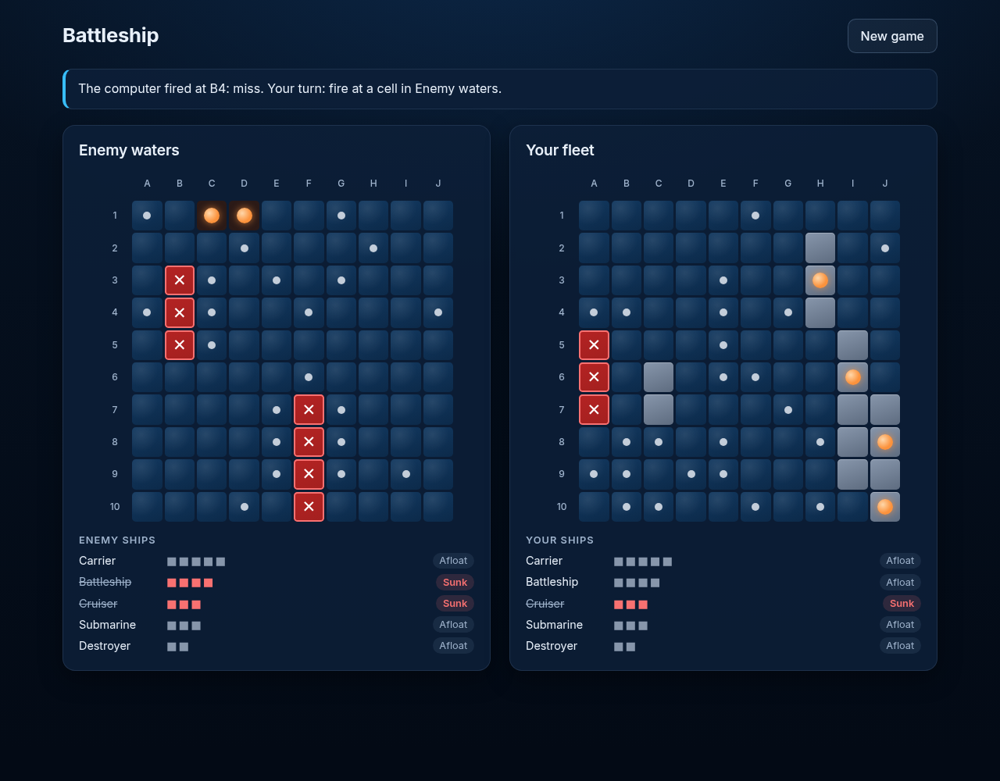

# Nebula Strike

An intergalactic take on Battleship: find and destroy the computer's fleet before it destroys yours.

[](https://github.com/allymueller1/battleship/actions/workflows/deploy.yml)

**Play it live: https://allymueller1.github.io/battleship/**



## How to play

1. Press **Launch** on the title screen (any key or click skips the
   briefing), then pick a mission card — Cadet, Captain or Admiral — and
   press **Start mission**.
2. Deploy your fleet: choose a ship, then click or tap a cell. The preview is
   green where the ship fits and red where it doesn't. **Rotate** (or press
   **R**) turns the ship, **Randomize** deploys the whole fleet for you, and
   you can drag a placed ship to a new spot (or select it to pick it back
   up). The
   **Change** link takes you back to the mission cards without losing your
   ships.
3. Press **Start battle**, then strike cells on the **Enemy sector** board.
   A miss is a dot, a hit is a marker, and a destroyed ship glows orange
   and shows as a wreck. The fleet trackers show which of your ships and the
   enemy's are still afloat. The status area keeps your last strike and the
   enemy's last strike on separate lines.
4. When a battle ends, the end screen shows the result plus each side's
   strikes and hits. **Play again** starts over on the same mission.

Your five fastest wins per level are kept on the mission-select screen —
saved only in this browser. **Clear scores** wipes them.

Keyboard: **Tab** moves between controls and boards, **arrow keys** move
within a board (and between level cards), **Enter** or **Space** fires or
places, and **R** rotates the selected ship on the placement screen.

## How the computer plays

| Level            | Style                                                            | Mechanism                                                                                                                                 | Average shots to win |
| ---------------- | ---------------------------------------------------------------- | ----------------------------------------------------------------------------------------------------------------------------------------- | -------------------- |
| Cadet (Easy)     | Fires at random and finds you by luck.                           | Picks a uniformly random untried cell.                                                                                                    | ~96                  |
| Captain (Normal) | Sweeps the sector, then hunts down any ship it hits.             | Hunts on a checkerboard pattern; after a hit it probes the neighbours, follows the line until the ship sinks, and handles touching ships. | ~52                  |
| Admiral (Hard)   | Calculates where your ships most likely are before every strike. | Counts every legal placement of the remaining ships, weights placements through unresolved hits, and fires at the densest cell.           | ~43                  |

Averages measured over 200 simulated games per level. No level can see your
ships — each only knows its own hits, misses and sunk ships — and none ever
fires at the same cell twice.

## Tech stack

- TypeScript, strict mode
- Vite — no UI framework, plain DOM
- Vitest with v8 coverage, 90% thresholds on the game logic and pure UI modules (see `vite.config.ts`)
- ESLint + Prettier
- GitHub Actions + GitHub Pages
- Inter and Orbitron, self-hosted via `@fontsource-variable/inter` and `@fontsource/orbitron`
- No backend — it's a static site

## Run it locally

Requires Node.js 22 (see `.nvmrc`).

```sh
npm ci
npm run dev
```

The dev server serves the game at `/battleship/`.

## Tests and checks

| Command                | Description                        |
| ---------------------- | ---------------------------------- |
| `npm run dev`          | Start the Vite dev server          |
| `npm run build`        | Typecheck and build for production |
| `npm run preview`      | Preview the production build       |
| `npm run typecheck`    | Typecheck without emitting         |
| `npm test`             | Run tests once with Vitest         |
| `npm run test:watch`   | Run tests in watch mode            |
| `npm run coverage`     | Run tests with coverage            |
| `npm run lint`         | Lint with ESLint                   |
| `npm run format`       | Format with Prettier               |
| `npm run format:check` | Check formatting with Prettier     |

CI runs lint, format:check, typecheck, coverage and build on every pull
request. On `main`, the same checks run again and the deploy to GitHub Pages
only happens if they all pass.

## Project structure

The layout separates pure game logic from DOM rendering:

- `src/game/types.ts` — shared types: coords, ships, boards, shot results
- `src/game/coord.ts` — coordinate keys, bounds checks, neighbors
- `src/game/ships.ts` — the five-ship fleet spec
- `src/game/rng.ts` — seedable RNG (mulberry32) injected everywhere
- `src/game/board.ts` — board creation and ship placement
- `src/game/shots.ts` — shot resolution and fleet status
- `src/game/game.ts` — game state, turn order, win detection
- `src/game/ai/view.ts` — what the opponent can see: untried cells, unresolved hits
- `src/game/ai/easy.ts` — easy opponent: uniform random untried cell
- `src/game/ai/normal.ts` — normal opponent: checkerboard hunt, then targets hit lines
- `src/game/ai/hard.ts` — hard opponent: probability-density targeting (argmax shot)
- `src/game/ai/index.ts` — difficulty dispatch and the computer's turn
- `src/main.ts` — entry point, mounts the app
- `src/ui/app.ts` — mounts the app and wires placement, battle and end screens
- `src/ui/boardView.ts` — accessible, keyboard-navigable board grid
- `src/ui/fleetTracker.ts` — afloat/sunk list per side
- `src/ui/interactivity.ts` — decides which board accepts input in each phase
- `src/ui/levels.ts` — mission names, descriptions and average shots for the mission cards
- `src/ui/leaderboard.ts` — the localStorage-backed leaderboard of your fastest wins
- `src/ui/placement.ts` — pure placement state
- `src/ui/messages.ts` — status and shot message text
- `src/ui/theme.ts` — the space-themed display name for each ship type
- `src/ui/titleScreen.ts` — the title screen and its skippable typed briefing
- `src/ui/effects.ts` — which cells get strike effects, and the effect timings
- `src/ui/shipArt.ts` — the SVG art for each ship type

All of `src/game/` is pure, immutable logic tested with Vitest; tests live
next to their modules as `<module>.test.ts`. `DEBUGGING.md` is a log of
every bug found during development and how it was fixed.

## Built with Devin

This project was built by Devin, Cognition's AI software engineer, from
Ally's written specs. The work went in as staged pull requests — project
setup, game logic, the computer opponent, the UI, deployment, then a design
pass — each reviewed and merged by Ally. Bugs found by Devin Review and by
self-testing were logged in `DEBUGGING.md` along the way.

## License

MIT — see [LICENSE](LICENSE).
